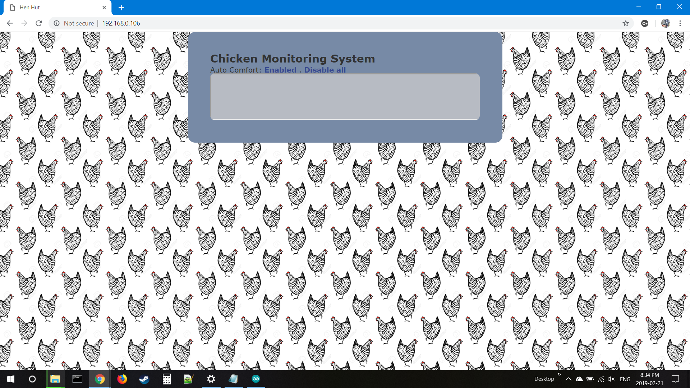

# Chicken-Patrol
Add monitoring and climate control to the chicken coop. 

This arduino sketch is for a ESP8266. If you have never used a ESP8266 before simply follow a guide like this one <a target="_blank" rel="noopener noreferrer" href=http://www.whatimade.today/esp8266-easiest-way-to-program-so-far/> [here] </a>. Google is your friend.

Once you are connected to the ESP8266 in the arduino IDE. Run a "blink" example to make sure everything is connected up properly. If the built in LED is flashing, then your doing great. If not, back to the google. 

Now you are ready to try this out. First make a project folder. Then download all the files to it. Most importantly you will need:
-Chicken_coop_webserver.ino 
-index.h

index.h is the actual webpage html code. This is my first attempt at making a website. I have learned alot since writing this and would like to update this to use bootstrap. Look for version 2 in the future. 

Upload the .ino and attempt to connect to the website by typing the IP in your browser. The static IP address did not work to well for me, some times it was 192.168.0.100 and other times it was 192.168.0.106. If you know why this is happening, sharing is caring. 

Now this sketch uses a temperature sensor and 2 relays. One relay is for high temperature which will turn on a fan. The other is for low temperature which will turn on a heater. The heater is simply a 100w incandecent bulb, or a heat lamp. Just somthing to take the edge off. Be careful with ceramic/oil heaters as they can draw more amperage then the relay is capable of supplying. 

Wire the esp8266 with these pins

int tempPin = A0;

int heatPin = D0;

int fanPin = D3;

Once the wiring is complete. Deploy it in your chicken coop! 

Here is some pictures of my build. 

First winter outside and no frost bite. :) 

